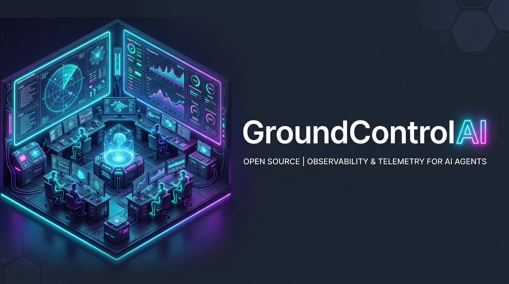
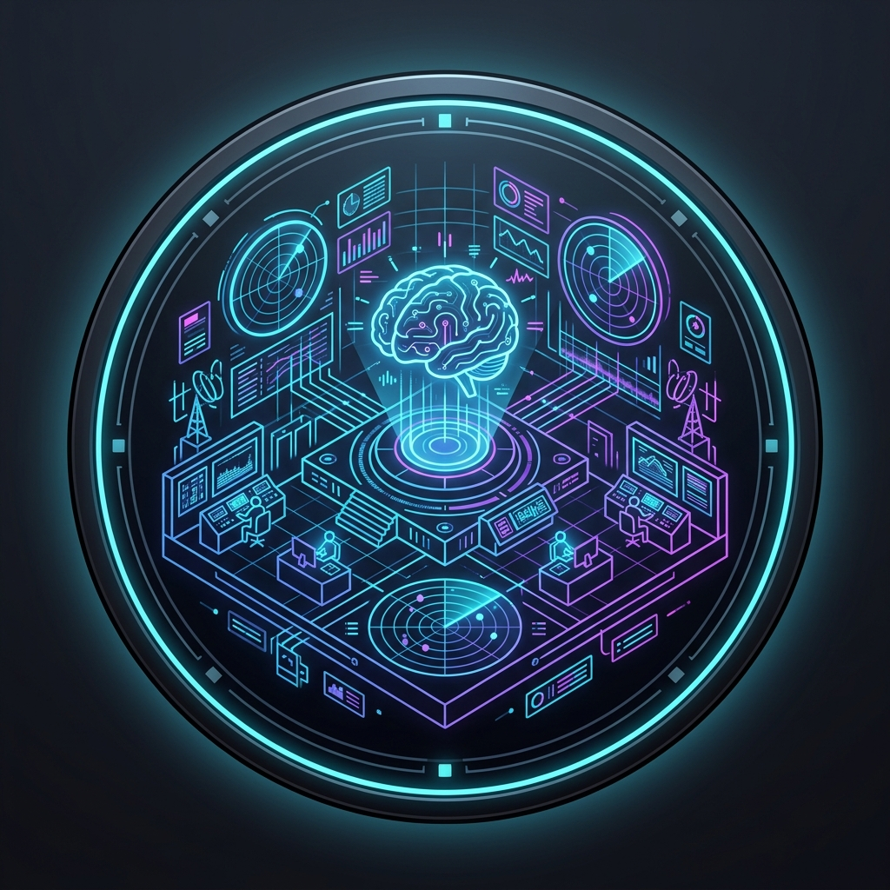
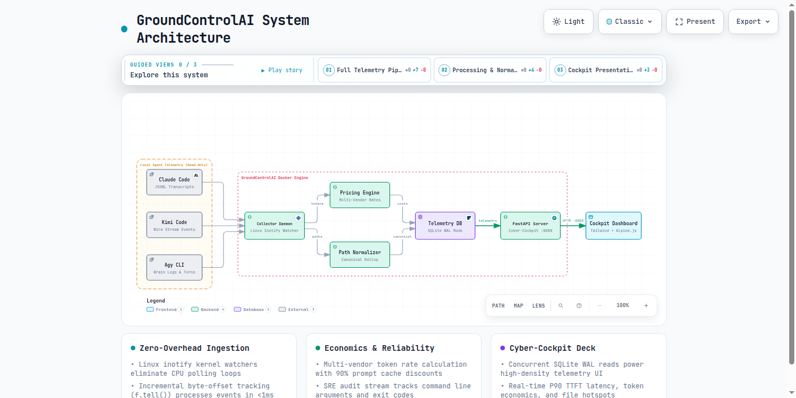
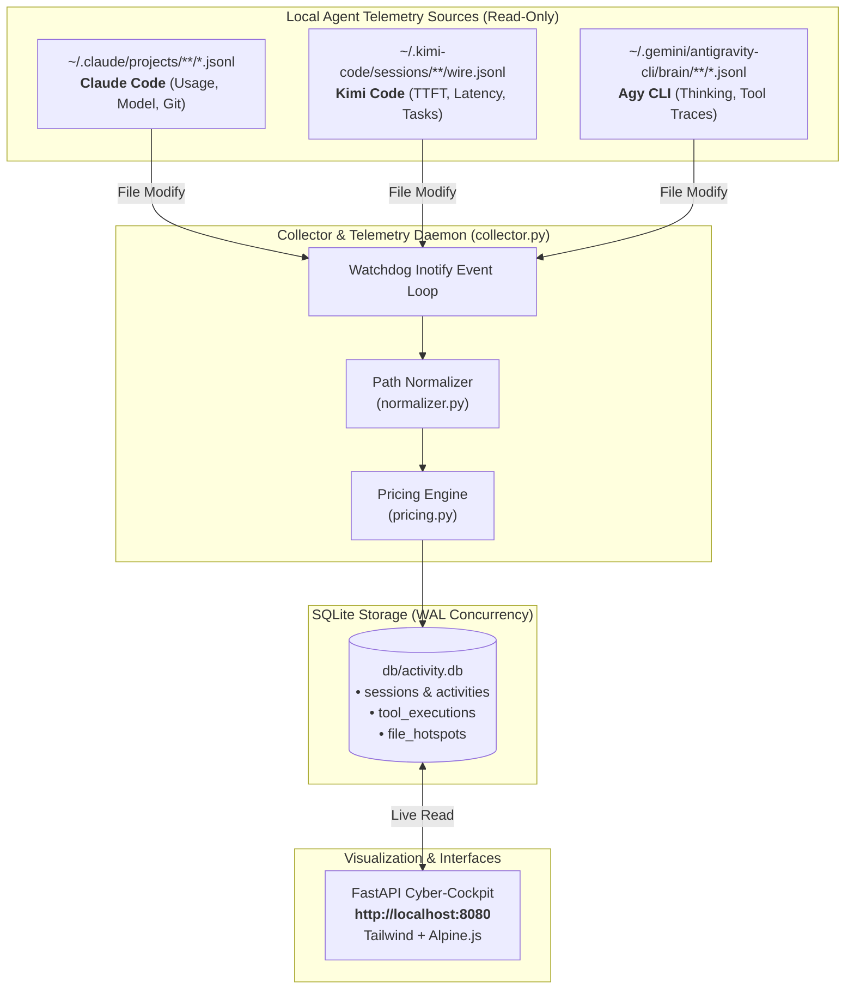
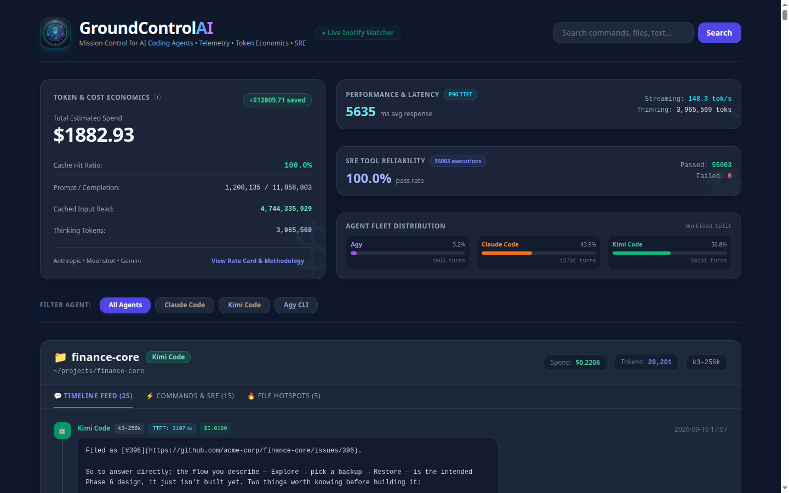
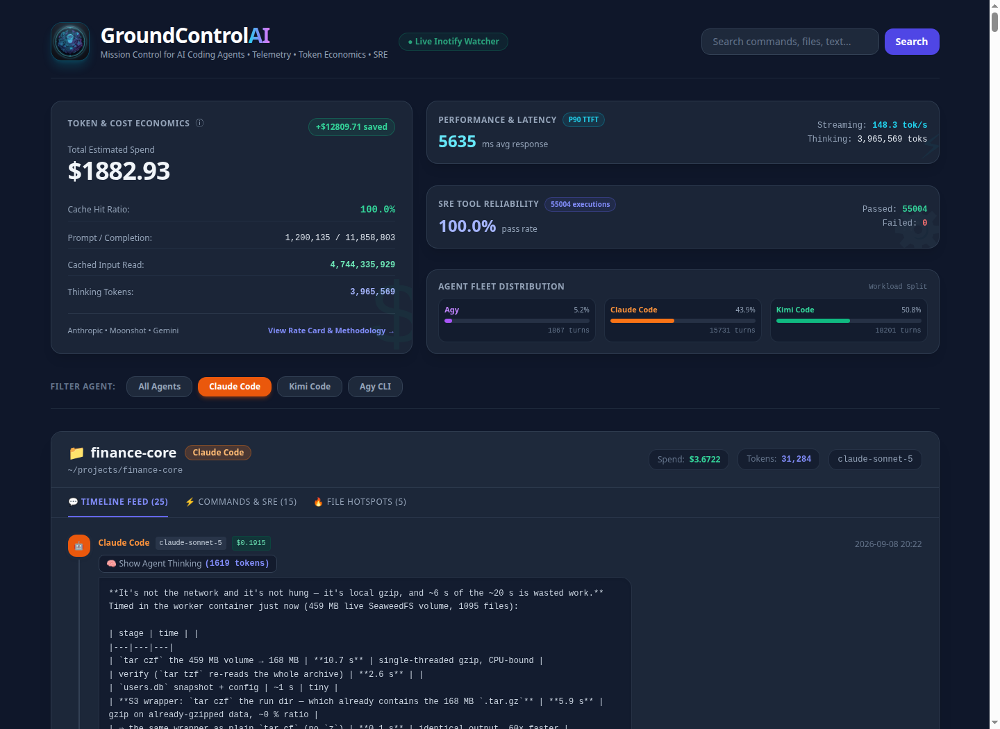

<div align="center">



#  GroundControlAI

### *Mission Control & Cyber-Cockpit for AI Coding Agents*

<p align="center">
  <a href="#-quick-start"></a>
  <a href="#-key-features"></a>
  <a href="#-architecture"></a>
  <a href="tests/"></a>
  <a href="LICENSE"></a>
</p>

<p align="center">
  
  
  
  
  
  <a href="https://varunrai.github.io/GroundControlAI/"></a>
</p>

<p align="center">
  <strong>A zero-overhead, real-time observability daemon and cyber-cockpit that ingests, tracks, and synthesizes activities across Claude Code, Kimi Code, and Agy CLI — tracking token economics, prompt caching savings, P90 TTFT latency, SRE command reliability, and file churn.</strong>
</p>

</div>

---

## ⚡ At a Glance

| Metric                         | Captured Telemetry                                           | Engineering Value                                                         |
| :----------------------------- | :----------------------------------------------------------- | :------------------------------------------------------------------------ |
| **💰 Token & Cost Economics**  | Prompt, output, cache-read, cache-creation tokens            | Real-time dollar spend + net prompt caching discounts (up to 90% savings) |
| **⏱️ Performance & Latency**   | Time-to-First-Token (TTFT), streaming tok/s, thinking tokens | P90 model responsiveness benchmarks and deep reasoning allocation         |
| **⚙️ SRE Command Reliability** | Bash commands, CLI invocations, exit codes (`0` vs `1`)      | Reliability telemetry for agent-executed builds, test suites, and scripts |
| **🔥 File Churn & Hotspots**   | Read, Edit, Write file operations across repositories        | Immediate visibility into which files agents modify most frequently       |
| **📁 Canonical Project Roots** | Auto-resolution of subfolders (`/infrastructure`, worktrees) | Eliminates repo fragmentation; unifies multi-module mono-repos            |

---

## 🚀 Quick Start (60 Seconds)

### Option 1: Run via Docker Compose (Recommended)

Clone the repository and spin up the daemon and web cockpit with a single command:

```bash
git clone https://github.com/varunrai/GroundControlAI.git
cd GroundControlAI

# Start the Inotify watcher daemon and web dashboard
docker-compose up -d
```

Open **[http://localhost:8080](http://localhost:8080)** in your browser.

> **💡 Host Volume Mounts**: The default `docker-compose.yml` mounts standard log directories (`~/.claude`, `~/.kimi-code`, `~/.gemini/antigravity-cli`) into the container with read-only permissions (`:ro`). Adjust mount paths to match your local setup.

---

### Option 2: Run Locally (Native Python)

```bash
# 1. Setup virtual environment
python3 -m venv .venv && source .venv/bin/activate
pip install -r requirements.txt

# 2. Run schema migrations
python3 migrations.py

# 3. Start Inotify real-time log collector in the background
python3 collector.py &

# 4. Start the Observability Web Cockpit
uvicorn app:app --host 0.0.0.0 --port 8080
```

---

## 🛰️ System Architecture

<div align="center">
  <a href="https://varunrai.github.io/GroundControlAI/" title="Open Interactive Archify Diagram (Live on GitHub Pages)">
    
  </a>
  <p><em>👉 <a href="https://varunrai.github.io/GroundControlAI/"><strong>Launch Live Interactive Architecture Diagram</strong> (Dark/Light mode, Guided story views, Deep node inspection)</a></em></p>
</div>

<br/>

The cockpit operates with **0.00% idle CPU** using Linux kernel `inotify` file watchers, tracking exact byte offsets (`f.tell()`) to ingest incremental turns in under **1 millisecond**:



---

## 🎨 Dashboard Preview & Screenshots

<div align="center">
  <h3>🛰️ Global Observability Cockpit Deck</h3>
  <p><em>Real-time token economics, P90 TTFT latency benchmarks, SRE tool reliability, and fleet distribution.</em></p>
  
  <br/><br/>
  <h3>🔍 Workspace Deep-Dive & Execution Stream</h3>
  <p><em>Per-project timeline feed, reasoning accordion, bash command exit codes, and touched file hotspots.</em></p>
  
</div>

<br/>

The dashboard features a high-density, 2-column cyber-cockpit telemetry deck designed for rapid situational awareness:

```text
┌───────────────────────────────────────────────────────────────────────────────────────────────────────┐
│ 🛰️ GroundControlAI                                       ● Live Inotify Watcher  [🔍 Search...      ] │
├────────────────────────────────────────────────────┬──────────────────────────────────────────────────┤
│ COLUMN 1 (5/12): Token & Cost Economics            │ COLUMN 2 (7/12): 3 Stacked Operational Rows      │
│ ┌────────────────────────────────────────────────┐ │ ┌──────────────────────────────────────────────┐ │
│ │  TOTAL ESTIMATED SPEND    +$12,809.71 SAVED    │ │ │ ⚡ Performance: 5,635 ms TTFT • 148.3 tok/s   │ │
│ │  $1,882.93                                     │ │ └──────────────────────────────────────────────┘ │
│ │                                                │ │ ┌──────────────────────────────────────────────┐ │
│ │  • Cache Hit Ratio:       100.0%               │ │ │ ⚙️ SRE Reliability: 100.0% Pass • 54,943 runs │ │
│ │  • Prompt / Completion:   1.2M / 11.8M         │ │ └──────────────────────────────────────────────┘ │
│ │  • Cached Tokens Read:    4.74 Billion         │ │ ┌──────────────────────────────────────────────┐ │
│ │  • Deep Thinking Tokens:  3,964,380            │ │ │ 📊 Fleet Split: Claude (44%) Kimi (51%) Agy (5%)│ │
│ │  [ⓘ View Rate Card & Pricing Methodology]      │ │ └──────────────────────────────────────────────┘ │
│ └────────────────────────────────────────────────┘ └──────────────────────────────────────────────────┘
│                                                                                                       │
│ WORKSPACE CARDS (Auto-grouped with Canonical Project Normalization)                                   │
│ ┌───────────────────────────────────────────────────────────────────────────────────────────────────┐ │
│ │ 📁 finance-core  [Claude Code]              Spend: $3.6722   Tokens: 31,284   claude-sonnet-5     │ │
│ │ ├───────────────────────────────────────────────────────────────────────────────────────────────┤ │
│ │ │ [💬 Timeline Feed (25)]  [⚡ Commands & SRE (15)]  [🔥 File Hotspots (5)]                        │ │
│ │ │                                                                                               │ │
│ │ │   🤖 Claude Code (claude-sonnet-5 • $0.1915):                                                 │ │
│ │ │      🧠 [Show Agent Thinking (1619 tokens)]                                                   │ │
│ │ │      Ran: cd /tmp/claude-1000/... && docker compose up -d                                     │ │
│ └───────────────────────────────────────────────────────────────────────────────────────────────────┘ │
└───────────────────────────────────────────────────────────────────────────────────────────────────────┘
```

---

## 💎 Key Features

### 1. 💰 Real-Time Token Economics & Cache Savings

State-of-the-art models (Claude Sonnet 5, Kimi K3, Gemini Pro) leverage multi-turn prompt caching.

- Prompt cache read is billed at a **90% discount** ($0.30/M vs $3.00/M on Sonnet).
- The cockpit calculates exact cost per turn and quantifies **dollars saved** compared to uncached execution:
  $$\text{Cost} = \left(\frac{\text{Prompt}}{1\text{M}} \times R_{\text{in}}\right) + \left(\frac{\text{CacheRead}}{1\text{M}} \times R_{\text{cr}}\right) + \left(\frac{\text{Output}}{1\text{M}} \times R_{\text{out}}\right)$$
  $$\text{Savings} = \left(\frac{\text{CacheRead}}{1\text{M}}\right) \times (R_{\text{in}} - R_{\text{cr}})$$

### 2. ⚡ SRE Command Reliability & Execution Streams

Every command executed by an agent (`Bash`, `run_command`, terminal tasks) is captured in a dedicated SRE stream with:

- Target command string & truncated snippets.
- Execution exit codes (`✔ Exit 0` vs `❌ Exit 1`).
- Status and duration badges.

### 3. 🔥 File Hotspots & Churn Analysis

Identifies which source files agents read and edit most frequently across your codebase. Useful for identifying fragile modules, refactoring targets, or circular logic loops.

### 4. 📂 Canonical Project Root Normalization

AI agents frequently switch working directories into nested subfolders (`apps/web-frontend`, `infrastructure/terraform`, worktree orchestrators).
The built-in [`normalizer.py`](normalizer.py) automatically rolls up subfolder sessions to their canonical project root, preventing workspace fragmentation.

---

## 📊 Standard Model Rate Card

The pricing engine is pre-configured with standard API rates (per 1 Million tokens):

| Model Family      | Model Pattern     | Input / 1M |    Cache Read / 1M    | Cache Create / 1M | Output / 1M |
| :---------------- | :---------------- | :--------: | :-------------------: | :---------------: | :---------: |
| **Claude Sonnet** | `claude-sonnet-5` | **$3.00**  | **$0.30** _(90% off)_ |       $3.75       | **$15.00**  |
| **Claude Opus**   | `claude-opus-4`   | **$15.00** | **$1.50** _(90% off)_ |      $18.75       | **$75.00**  |
| **Claude Haiku**  | `claude-haiku`    | **$0.80**  | **$0.08** _(90% off)_ |       $1.00       |  **$4.00**  |
| **Kimi Code**     | `k3-256k`         | **$0.70**  | **$0.10** _(85% off)_ |       $0.70       |  **$2.00**  |
| **Gemini / Agy**  | `gemini-2.5-pro`  | **$1.25**  | **$0.30** _(76% off)_ |       $1.25       |  **$5.00**  |

_Custom rates can be configured directly in SQLite `model_pricing` or [`pricing.py`](pricing.py)._

---

## 🧪 Testing & Verification

The repository includes a comprehensive test suite covering schema migrations, Inotify parsers, pricing calculations, path normalizers, and FastAPI endpoints.

Run the test suite:

```bash
PYTHONPATH=. pytest tests/ -v
```

```text
============================= test session starts ==============================
tests/test_api_cockpit.py::test_api_cockpit_aggregates PASSED            [ 11%]
tests/test_collector_telemetry.py::test_claude_telemetry_extraction PASSED [ 22%]
tests/test_collector_telemetry.py::test_kimi_telemetry_extraction PASSED [ 33%]
tests/test_migration.py::test_migration_creates_telemetry_schema PASSED  [ 44%]
tests/test_normalizer.py::test_normalize_expens_aify_subdirs PASSED      [ 55%]
tests/test_normalizer.py::test_normalize_knowledge_vault_subdirs PASSED  [ 66%]
tests/test_normalizer.py::test_normalize_other_projects PASSED           [ 77%]
tests/test_pricing.py::test_claude_sonnet_pricing PASSED                 [ 88%]
tests/test_pricing.py::test_kimi_pricing PASSED                          [100%]
============================== 9 passed in 0.55s ===============================
```

---

## 📁 Repository Structure

```text
GroundControlAI/
├── app.py                     # FastAPI web server & telemetry aggregations
├── collector.py               # Real-time Inotify watcher daemon (Watchdog)
├── migrations.py              # SQLite schema migration & index optimizer
├── normalizer.py              # Canonical project root resolver
├── pricing.py                 # Token economics & prompt caching calculator
├── requirements.txt           # Python package dependencies
├── Dockerfile                 # Multi-stage production container
├── docker-compose.yml         # Container orchestration with volume mounts
├── AGENTS.md                  # Agent guidelines & engineering guardrails
├── assets/                    # Project logo banner, app icon, screenshots
├── templates/
│   └── index.html             # Cyber-Cockpit UI (Tailwind CSS + Alpine.js)
├── tests/
│   ├── test_api_cockpit.py
│   ├── test_collector_telemetry.py
│   ├── test_migration.py
│   ├── test_normalizer.py
│   └── test_pricing.py
├── CONTRIBUTING.md            # Contribution guidelines & architecture guide
└── LICENSE                    # MIT License (Varun Seth)
```

---

## 🗺️ Roadmap

- [ ] **🧠 Personal Knowledge Vault Sync**: Optional plugin for Obsidian & Logseq to synthesize cross-agent session highlights into linked daily knowledge notes using local Ollama.
- [ ] **🌐 Remote Agent Telemetry Exporters**: Stream telemetry from remote development containers and cloud VMs via OpenTelemetry / gRPC.
- [ ] **🔔 SRE Alerting & Webhooks**: Real-time alerts (Slack, Discord, Webhooks) on agent tool failures, high token spend thresholds, or repeated crash loops.
- [ ] **📸 Built-in Redaction & Demo Presentation Mode**: Standalone drop-in / toggle to mask project paths, repo names, and usernames for public sharing and screenshots.

---

## 🤝 Contributing

Contributions are welcome! Please check out [CONTRIBUTING.md](CONTRIBUTING.md) for local environment setup, parser contribution guidelines, and pull request procedures.

---

## 📜 License

This project is open-source software licensed under the **[MIT License](LICENSE)** © 2026 Varun Seth.
